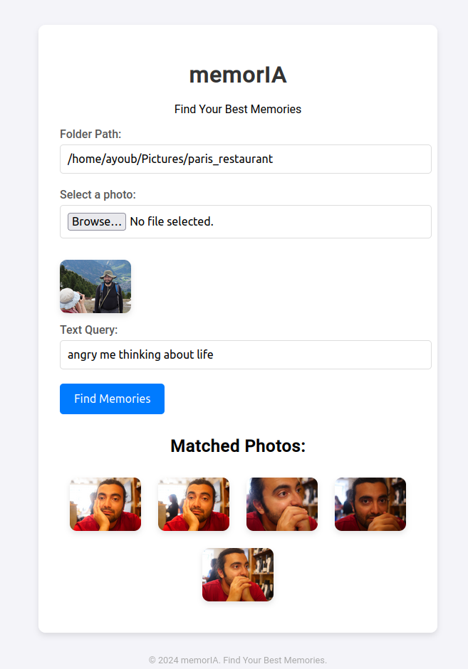

# memorIA

**Find Your Best Memories**

memorIA is a web application that allows users to search through their local photos using AI. With a simple and intuitive interface, users provide a text query and if needed a input photo to find matched memories in their personal photo library.

<div style="display: flex; justify-content: center;">
    
    
</div>

## Features

- **Semantic Search**: Search your local photos by providing a descriptive text query.
- **Person Search**: Search your local photos by uploading an input photo of the person you are looking for.
- **Local Storage**: Everything is processed locally, ensuring privacy and security.

## Installation

To set up the memorIA web app on your local machine, follow these steps:

1. Clone the repository:

   ```bash
   git clone https://github.com/ayouboumani/memorIA.git
   cd memorIA
   ```

2. Install the required Python packages:

   ```bash
   pip install -r requirements.txt
   ```

3. Run the application:

   ```bash
   python app.py
   ```

4. Open your web browser and navigate to `http://127.0.0.1:5000`.

## Usage

1. Enter the path of the folder containing your photos.
2. (Optional) Select an input photo from your local storage.
3. Provide a text query to describe your memory.
4. Click the "Find Memories" button to see matched photos.

## Contributing

Contributions are welcome! If you have suggestions or improvements, please feel free to open an issue or submit a pull request.

## License

This project is licensed under the MIT License - see the [LICENSE](LICENSE) file for details.

## Acknowledgments

- Thanks to the open-source community for providing libraries and tools that made this project possible.

